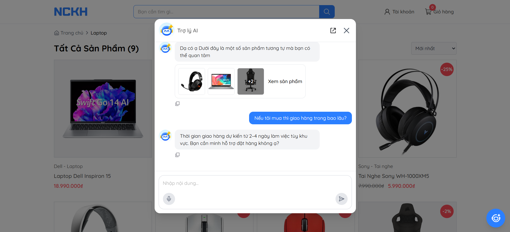

# Xây dựng trợ lý ảo đặt hàng và tư vấn sản phẩm theo kiến trúc Microservice

Đề tài nghiên cứu khoa học về trợ lý ảo đóng vai trò như một người bán hàng thông minh – tư vấn, gợi ý sản phẩm theo nhu cầu, giải đáp thắc mắc, và hỗ trợ đặt hàng trong hệ thống thương mại điện tử.




## Cài đặt môi trường

**1. Clone repository**

```
https://github.com/lamquang4/NCKH.git
```

**2. Chạy website bằng Docker**

```
docker compose up --build
```

## Công nghệ sử dụng

| Hạng mục         | Công nghệ / Công cụ       |
| ---------------- | ------------------------- |
| Frontend         | Vite, TypeScript, ReactJS |
| Backend          | Spring Boot               |
| Containerization | Docker                    |
| Database         | MySQL, MongoDB, Redis     |
| Media Storage    | Cloudinary                |
| CI/CD            | GitHub Actions            |

## Triển khai môi tường thực tế

| Hạng mục   | Môi trường / Nền tảng |
| ---------- | --------------------- |
| Frontend   | Render                |
| Backend    | Render                |
| DB MySQL   | Aiven                 |
| DB MongoDB | MongoDB Atlas         |
| DB Redis   | Upstash               |
